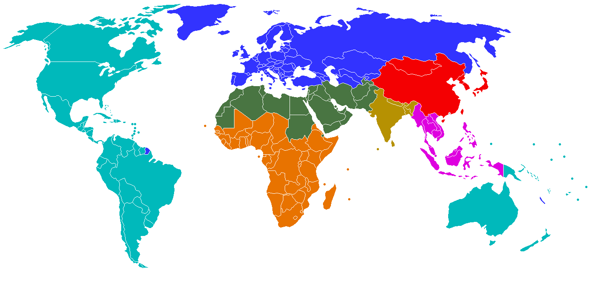
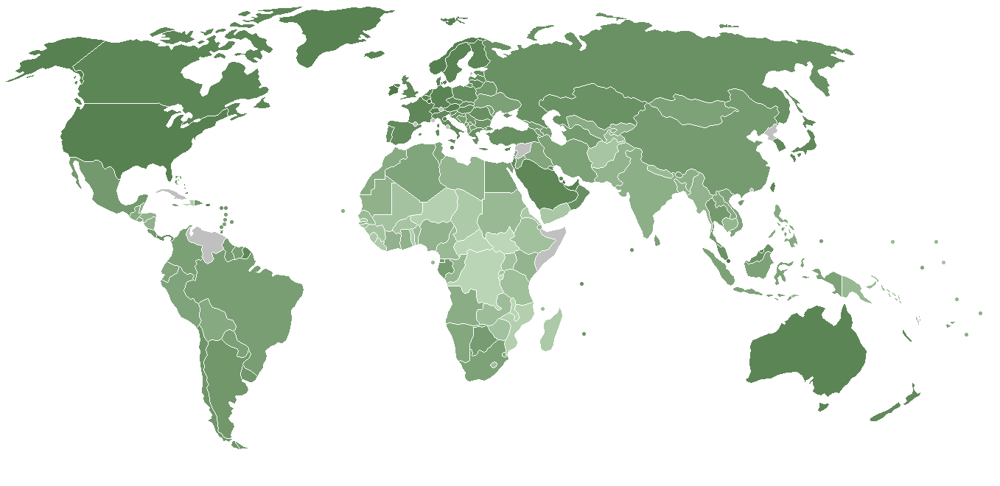
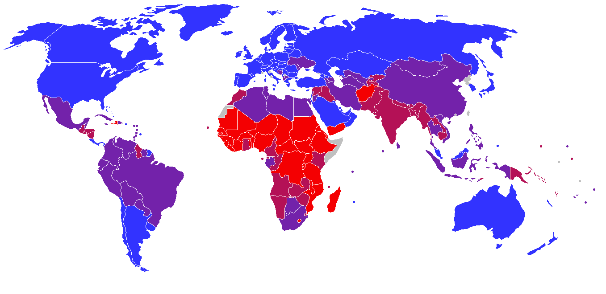

# GeoMapper
Simply, this is a lightweight tool for creating colored map, based on countries (or territories) data.
It has three ways of colorization.

## Straight mode
Use it for colorization of country sets in some colors. Below is an example of 7 group of countries with similar geographic and cultural background.

## Scale mode
Use it for colorization of countries based on value (gdp, hdr, population, etc.). Below is an example of countries by GDP (PPP) per capita.

## Step mode
Use it for colorization of countries based on value (gdp, hdr, population, etc.), when you want to group some values. For example, you can color countries with population between 10M and 100M in one color. Below is an example of countries by HDI.

