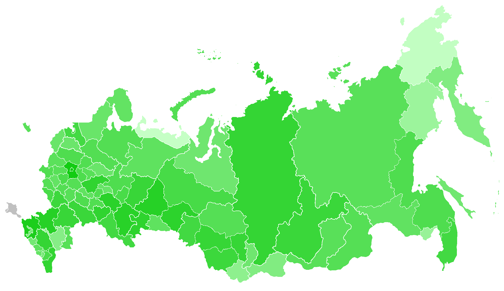
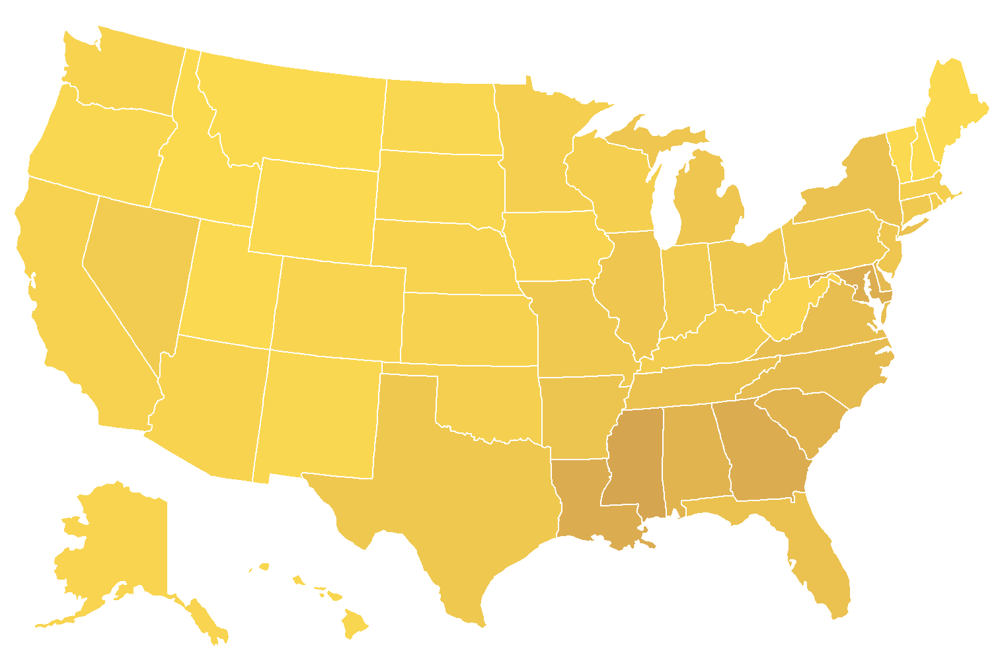

# GeoMapper
Simply, this is a lightweight tool for creating colored map, based on countries (or territories) data.
It has three ways of colorization.

## Straight mode
Use it for colorization of country sets in some colors. Below is an example of 7 group of countries with similar geographic and cultural background.

For the same result use this command:
`
straight countries
-importFrom "src/main/resources/example/groups.csv"
-column blue 0
-column red 1
-column orange 2
-column yellow 3
-column green 4
-column fuchsia 5
-column teal 6
`

## Scale mode
Use it for colorization of countries based on value (gdp, hdi, population, etc.). Below is an example of countries by GDP (PPP) per capita.

For the same result use this command:
`
scale countries
-import "src/main/resources/example/gdp.csv" 1 2
-color green
-logarithmization 10
`

## Step mode
Use it for colorization of countries based on value (gdp, hdi, population, etc.), when you want to group some values. For example, you can color countries with population between 10M and 100M in one color. Below is an example of countries by HDI.

For the same result use this command:
`
step countries
-import "src/main/resources/example/hdi.csv" 2 3
-colors blue red
-separators 3 0.8 0.7 0.55
`

## Custom maps
You can use this tool not only for the map of countries. Below is an example of Russian subjects by population (except Crimea and Sevastopol). 

For the same result use this command:
`
scale russia
-import "src/main/resources/example/rus-population.csv" 2 6
-color lime
-logarithmization 2
`

And here is one more example of USA states ranked by proportion of African American population

For the same result use this command:
`
scale usa
-import "src/main/resources/example/usa-african-american.csv" 2 0
-colors brown pale_yellow
-min 0
-max 100
`
